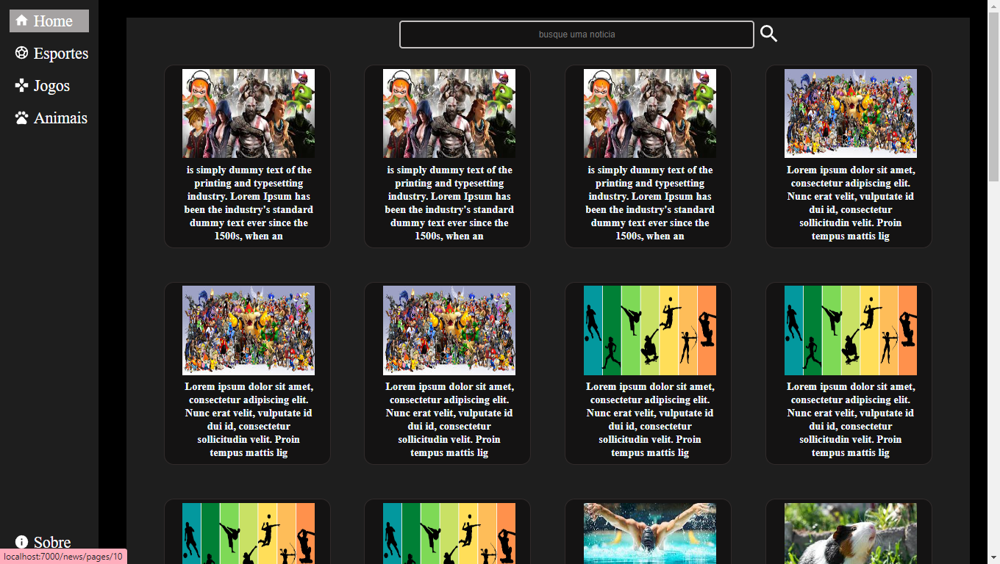
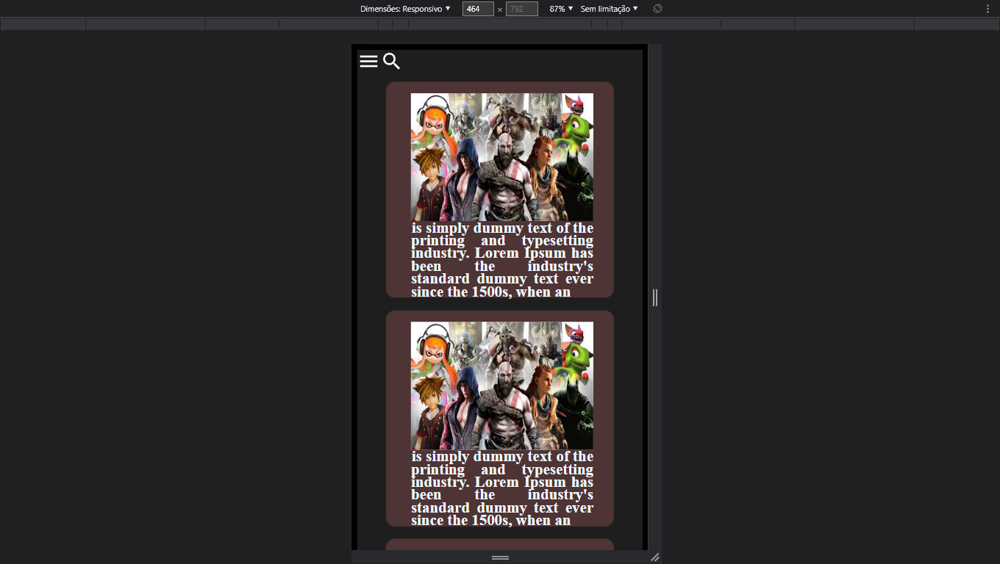

# news_
 
# NEWS
### Resumo:
#### Um site de notícias
#### Crie, Delete ,Atualize e veja uma notícia em tempo real

### Tecnologias utilizadas:
 - Express
 - React
 - Mysql
 - Jest
 - Webpack

### Características:
 - [X] Apis
 - [X] Tests Apis
 - [X] Front
 - [ ] Tests Front
### Modo de uso:

<pre>
<code>
clone este repositorio
cd news_
cd APP
yarn  start //para iniciar o servidor
yarn start:dev //para inicar o reactjs
yarn test //para testar as apis
</code>
</pre>
